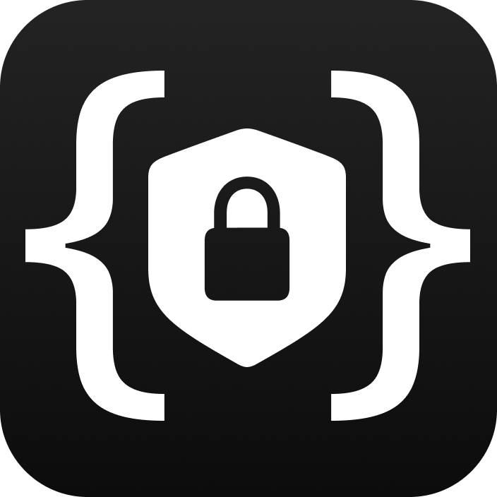

<div align="center">
  
  <a href="https://github.com/TheEdoRan/next-safe-action"><h1>next-safe-action</h1></a>
</div>

> next-safe-action is a library that takes full advantage of the latest and greatest Next.js, React and TypeScript features, using Zod, to let you define typesafe Server Actions and execute them inside Client Components.

## How does it work?

Like magic. 🪄

https://github.com/TheEdoRan/next-safe-action/assets/1337629/7ebc398e-6c7d-49b2-8d03-e85e17d2ae32

## Features

- ✅ Pretty simple
- ✅ End-to-end type safety
- ✅ Context based clients (with middlewares)
- ✅ Input validation using Zod
- ✅ Advanced server error handling
- ✅ Optimistic updates

## Documentation

**Explore the documentation for version 5 of the library on the [next-safe-action website](https://next-safe-action.dev).** ✨

If you are looking for old versions documentation, check out:
- the [README_v3](packages/next-safe-action/README_v3.md) file for version 3.x.x.
- the [README_v2](packages/next-safe-action/README_v2.md) file for version 2.x.x.

## Next.js >= 14 vs 13

Server Actions are now a stable feature in React. For this reason, there were some internal breaking changes to the API, and so a new version of the library is required to prevent backward compatibility issues.

**You can continue to use `next-safe-action` version 4 for your Next.js 13 app:**

```bash
# For Next.js 13 apps
npm i next-safe-action@v4


# For Next.js >= 14 apps
npm i next-safe-action
```

## Migration guide

Version 4.x.x of the library introduced some breaking changes to the API. Please check out the [v3 to v4 migration guide](https://next-safe-action.dev/docs/migration-from-v3-to-v4) on the website for more information.

---

Version 5.x.x of the library is required for Next.js >= 14 applications. Please check out the [v4 to v5 migration guide](https://next-safe-action.dev/docs/migration-from-v4-to-v5) on the website for more information.

## Example

You can find a basic working implementation of the library [here](packages/example-app).

## Contributing

If you want to contribute to next-safe-action, the best way is to fork this repository and [open a pull request](https://github.com/TheEdoRan/next-safe-action/pulls) when you're done implementing your feature.

If you found bugs or just want to ask a question, feel free to [open an issue](https://github.com/TheEdoRan/next-safe-action/issues).

## Contributors

<a href="https://github.com/TheEdoRan/next-safe-action/graphs/contributors">
  
</a>

Made with [contrib.rocks](https://contrib.rocks).

## License

next-safe-action is released under the MIT license.
